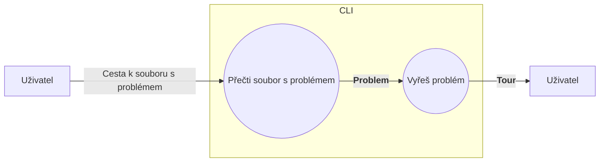
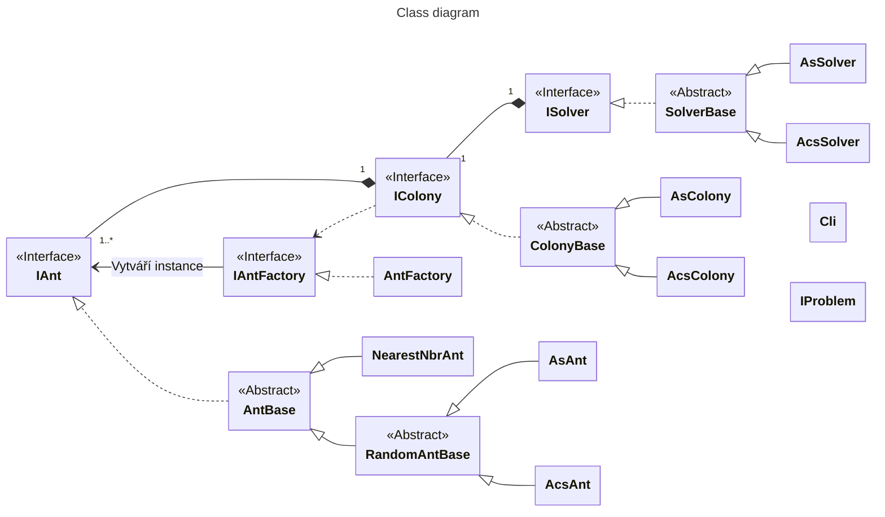

# Dekompozice

```mermaid
flowchart LR

userin[Uživatel]
userout[Uživatel]
parser((Přečti soubor s problémem))
solver((Vyřeš problém))

userin --Cesta k souboru s problémem--> parser
subgraph CLI
    parser --"`**Problem**`"--> solver
end
solver --"`**Tour**`"--> userout
```

```mermaid
---
title: Class diagram
config:
    class:
        hideEmptyMembersBox: true
---
classDiagram

    direction RL

    SolverBase ..|> ISolver
    AsSolver --|> SolverBase
    AcsSolver --|> SolverBase

    ColonyBase ..|> IColony
    AsColony --|> ColonyBase
    AcsColony --|> ColonyBase

    AntFactory ..|> IAntFactory

    AntBase ..|> IAnt
    NearestNbrAnt --|> AntBase
    RandomAntBase --|> AntBase
    AsAnt --|> RandomAntBase
    AcsAnt --|> RandomAntBase

    ISolver "1" *-- "1" IColony
    IColony "1" *-- "1..*" IAnt
    IColony ..> IAntFactory
    IAntFactory --> IAnt : Vytváří instance

    class Cli

    class IProblem

    class ISolver{<<Interface>>}
    class SolverBase{<<Abstract>>}
    class AsSolver
    class AcsSolver

    class IColony{<<Interface>>}
    class ColonyBase{<<Abstract>>}
    class AsColony
    class AcsColony

    class IAntFactory~IAnt~{<<Interface>>}
    class AntFactory~IAnt~

    class IAnt{<<Interface>>}
    class AntBase{<<Abstract>>}
    class NearestNbrAnt
    class RandomAntBase{<<Abstract>>}
    class AsAnt
    class AcsAnt
```

