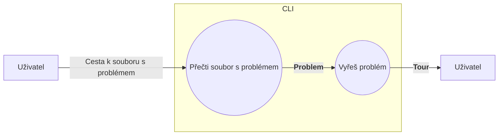

# Dekompozice

```mermaid
flowchart LR

userin[Uživatel]
userout[Uživatel]
parser((Přečti soubor s problémem))
solver((Vyřeš problém))

userin --Cesta k souboru s problémem--> parser
subgraph CLI
    parser --"`**Problem**`"--> solver
end
solver --"`**Tour**`"--> userout
```